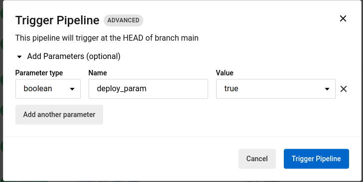

# Circle CI workflow to deploy to environment on demand trigger.

## How to Use?
- Integrtae the workflow in your source code.
- On commit to the main branch, the pipeline triggers and by default runs certain command, here placeholder kept is dev.

To run certaim command on another environment, from circleci UI override the value for parameter and trigger the parameter.  

## Use case
- Deploy application to specific environment say DEV or UAT for QA team to perform some tests before deploying it to customer facing environments.
- Run some set of commands to lower environments instead of directly running to higher environment.
- Upload some set of files to specific Test Storage say S3 bucket or File Share.
